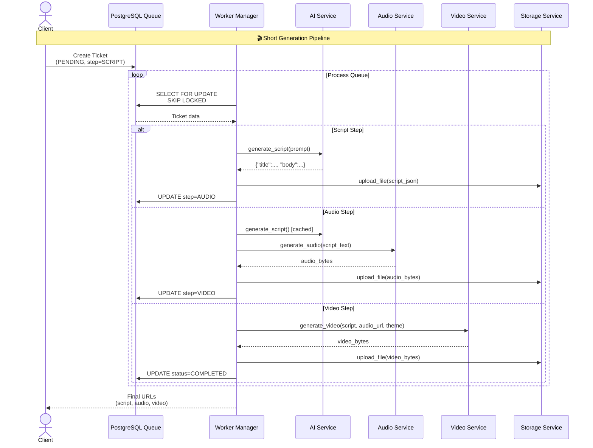
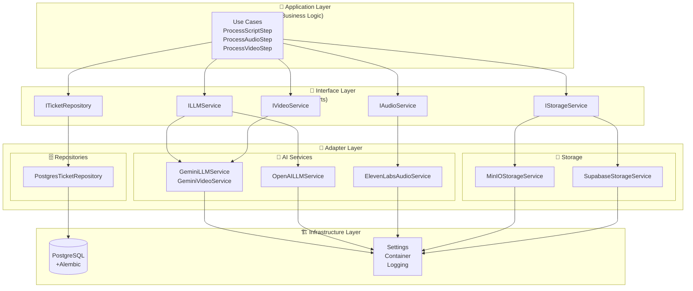
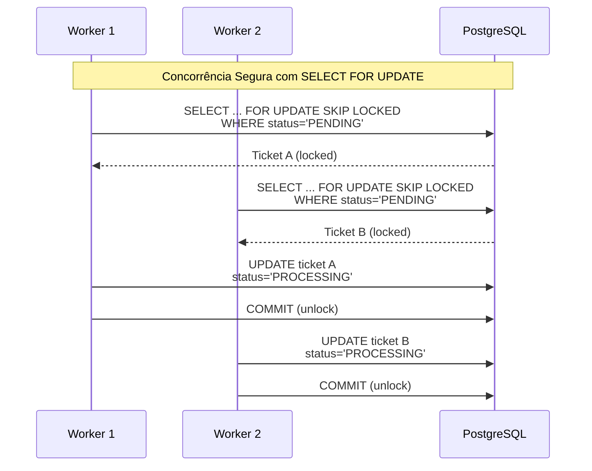
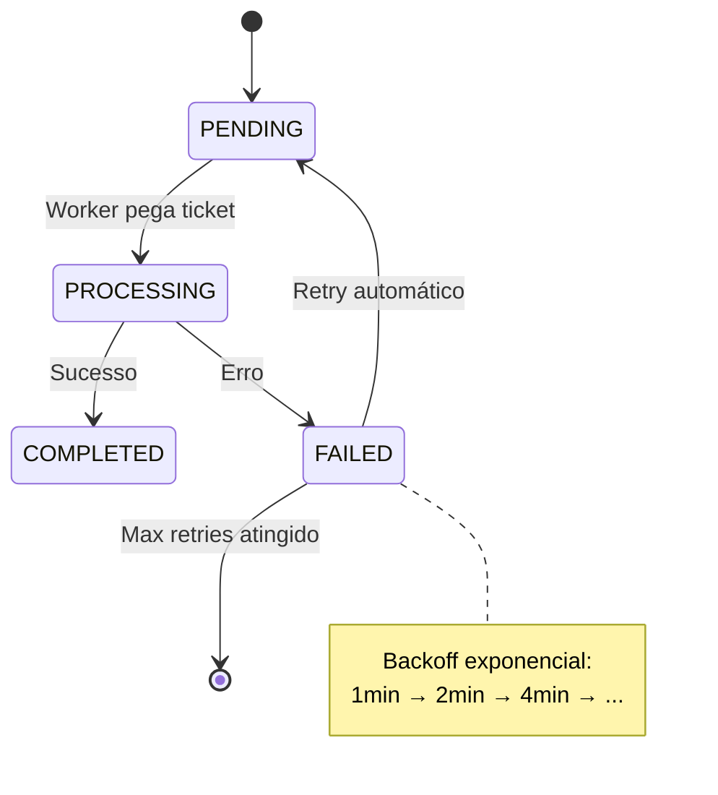
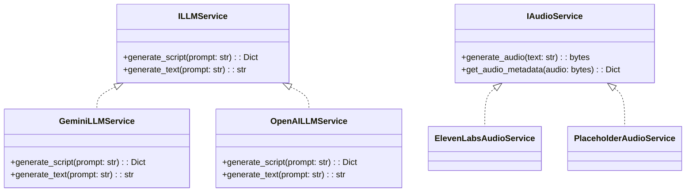

# 🏗️ Arquitetura e Fluxo - Shortsmaker Worker

**Sistema distribuído e assíncrono para processamento de vídeos curtos usando Clean Architecture.**

---

## 📋 Visão Geral

O **Shortsmaker Worker** é um sistema distribuído e assíncrono para processamento de requisições de geração de vídeos curtos (shorts). Utiliza **Clean Architecture** com separação clara entre camadas de domínio, aplicação, adaptadores e infraestrutura.

### ✨ Características Principais

- ✅ **Clean Architecture** - Código independente de frameworks e detalhes técnicos
- ✅ **Processamento Assíncrono** - Utiliza Python AsyncIO para máxima eficiência
- ✅ **Multi-Worker** - Múltiplos workers procesando a fila em paralelo
- ✅ **Resiliência** - Sistema de retry com backoff exponencial
- ✅ **Concorrência Segura** - Usa `SELECT ... FOR UPDATE SKIP LOCKED` do PostgreSQL
- ✅ **Injeção de Dependência** - Isolamento de testes e flexibilidade
- ✅ **Migrações Automáticas** - Alembic integrado ao ciclo de vida

---

## 🎯 Fluxo de Processamento End-to-End

### High-Level Overview



### Fluxo de Dados Detalhado

```mermaid
flowchart TD
    subgraph client["🖥️ Cliente/API"]
        A["POST /tickets<br/>{prompt: '...'}"]
    end

    subgraph queue["📋 Fila de Processamento<br/>(Database)"]
        B["INSERT Ticket<br/>status=PENDING<br/>step='SCRIPT'"]
    end

    subgraph script["📝 Etapa 1: Script"]
        C["Script Worker<br/>busca PENDING tickets"]
        D["LLM Generate Script<br/>(Gemini/OpenAI)"]
        E["UPDATE ticket<br/>status=PENDING<br/>step='AUDIO'"]
    end

    subgraph audio["🎙️ Etapa 2: Áudio"]
        F["Audio Worker<br/>busca PENDING tickets"]
        G["TTS Generate Audio<br/>(ElevenLabs)"]
        H["Upload para Storage<br/>(MinIO/Supabase)"]
        I["UPDATE ticket<br/>status=PENDING<br/>step='VIDEO'"]
    end

    subgraph video["🎥 Etapa 3: Vídeo"]
        J["Video Worker<br/>busca PENDING tickets"]
        K["Video Generate<br/>(Gemini Veo)"]
        L["Upload para Storage"]
        M["UPDATE ticket<br/>status=COMPLETED"]
    end

    subgraph result["✅ Resultado Final"]
        N["Retorna URLs<br/>script, audio, video"]
    end

    A -->|cria| B
    B -->|enfilera| C
    C -->|busca| D
    D -->|gera| E
    E -->|enfilera| F
    F -->|busca| G
    G -->|gera| H
    H -->|salva URLs| I
    I -->|enfilera| J
    J -->|busca| K
    K -->|gera| L
    L -->|salva URLs| M
    M -->|finaliza| N
```



---

## 🏛️ Arquitetura em Camadas

### Diagrama Consolidado



### Explicação das Camadas

#### 🎯 **Application Layer (Casos de Uso)**
- **Responsabilidade**: Lógica de negócio pura, orquestração de fluxos
- **Componentes**: `ProcessScriptStep`, `ProcessAudioStep`, `ProcessVideoStep`
- **Princípio**: Independente de frameworks e detalhes técnicos

#### 🔌 **Interface Layer (Portas)**
- **Responsabilidade**: Contratos abstratos para dependências externas
- **Componentes**: `ILLMService`, `IVideoService`, `IAudioService`, etc.
- **Princípio**: Dependency Inversion - application depende de abstrações

#### 🔧 **Adapter Layer (Implementações)**
- **Responsabilidade**: Implementações concretas dos contratos
- **Componentes**: Serviços de IA, repositórios, storage providers
- **Princípio**: Plugabilidade - fácil troca de implementações

#### 🏗️ **Infrastructure Layer (Infraestrutura)**
- **Responsabilidade**: Detalhes técnicos e configurações
- **Componentes**: PostgreSQL, Alembic, Settings, Logging, Container DI
- **Princípio**: Isolamento de concerns técnicos

---

## 🔄 Sistema de Concorrência e Segurança

### Database as Queue Pattern



**Vantagens:**
- ✅ **Atomicidade**: Uma transação por processamento
- ✅ **Isolamento**: Workers não interferem uns nos outros
- ✅ **Durabilidade**: Estado sempre consistente
- ✅ **Escalabilidade**: Quantos workers quiser

### Sistema de Retry e Recuperação



---

## 🔧 Padrões de Design Utilizados

### Strategy Pattern para Providers



### Dependency Injection Container

```python
# infra/config/container.py
class Container(DeclarativeContainer):
    config = providers.Singleton(Settings)

    # Repositories
    ticket_repository = providers.Singleton(
        PostgresTicketRepository,
        session_factory=async_session_factory
    )

    # Services
    llm_service = providers.Selector(
        config.provided.LLM_PROVIDER,
        gemini=providers.Singleton(GeminiLLMService, api_key=config.provided.GEMINI_API_KEY),
        openai=providers.Singleton(OpenAILLMService, api_key=config.provided.OPENAI_API_KEY)
    )
```

---

## 📊 Métricas de Performance

### Tempos Estimados por Etapa
- **Script Generation**: 3-8 segundos (LLM)
- **Audio Generation**: 5-15 segundos (TTS)
- **Video Generation**: 30-120 segundos (AI Video)
- **Storage Upload**: 1-3 segundos
- **Total**: ~40-150 segundos por vídeo

### Escalabilidade
- **Workers Paralelos**: Limitado apenas pelo banco e APIs externas
- **Throughput**: ~2-10 vídeos/minuto (dependendo dos providers)
- **Bottleneck**: APIs de IA (rate limits e latência)

---

## 🔒 Segurança e Resiliência

### Tratamento de Erros
- **Graceful Degradation**: Fallback para providers alternativos
- **Circuit Breaker**: Não implementado (TODO)
- **Dead Letter Queue**: Tickets FAILED não alertam (TODO)

### Observabilidade
- **Logs Estruturados**: JSON format com correlation IDs
- **Health Checks**: Não implementado (TODO)
- **Métricas**: Não implementadas (TODO)

---

## 🚀 Extensibilidade

### Adicionando Novo Provider de LLM

1. **Implementar Interface**:
```python
class NewLLMService(ILLMService):
    async def generate_script(self, prompt: str) -> Dict[str, Any]:
        # Implementação específica
        pass
```

2. **Registrar no Container**:
```python
# container.py
llm_service = providers.Selector(
    config.provided.LLM_PROVIDER,
    # ... existentes
    new_provider=providers.Singleton(NewLLMService, ...)
)
```

3. **Adicionar nas Settings**:
```python
# settings.py
llm_provider: Literal["gemini", "openai", "new_provider"] = "gemini"
new_api_key: Optional[str] = None
```

---

*Última atualização: Janeiro 2026*