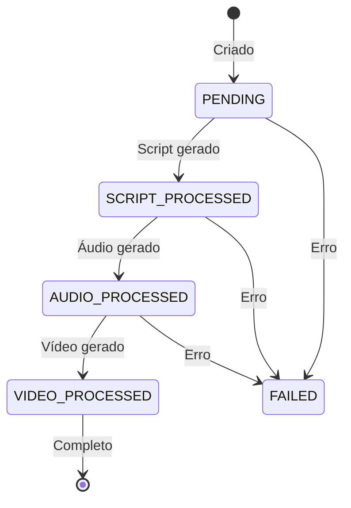

# 🔧 Detalhes de Implementação - Shortsmaker Worker

**Implementação técnica detalhada do sistema de processamento de vídeos curtos.**

---

## 📁 Estrutura do Projeto

```
shortsmaker-worker/
├── app/                          # Código principal
│   ├── main.py                   # Ponto de entrada
│   ├── adapter/                  # Adaptadores externos
│   │   ├── ai/                   # Serviços de IA
│   │   ├── audio/               # Serviços de áudio
│   │   ├── storage/             # Serviços de armazenamento
│   │   └── video/               # Serviços de vídeo
│   ├── core/                    # Regras de negócio
│   │   ├── application/         # Casos de uso
│   │   ├── domain/              # Entidades e regras
│   │   └── interfaces/          # Contratos
│   └── infra/                   # Infraestrutura
│       ├── config/              # Configurações
│       ├── database/            # Camada de dados
│       └── logging/             # Logs
├── tests/                       # Testes
├── docs/                        # Documentação
├── migrations/                  # Migrações DB
└── docker/                      # Configurações Docker
```

---

## 🏗️ Arquitetura Clean Architecture

### Camadas Principais

#### 1. **Domain Layer** (`core/domain/`)
Entidades e regras de negócio puras, independentes de frameworks.

```python
# core/domain/ticket.py
@dataclass
class Ticket:
    id: UUID
    status: TicketStatus
    script: Optional[str] = None
    audio_url: Optional[str] = None
    video_url: Optional[str] = None
    created_at: datetime = field(default_factory=datetime.utcnow)
    updated_at: datetime = field(default_factory=datetime.utcnow)

    def can_process_script(self) -> bool:
        return self.status == TicketStatus.PENDING

    def mark_script_processed(self, script: str):
        self.script = script
        self.status = TicketStatus.SCRIPT_PROCESSED
        self.updated_at = datetime.utcnow()
```

#### 2. **Application Layer** (`core/application/`)
Casos de uso que orquestram as regras de negócio.

```python
# core/application/use_cases/process_script_step.py
class ProcessScriptStep:
    def __init__(
        self,
        ticket_repository: ITicketRepository,
        llm_service: ILLMService,
        storage_service: IStorageService
    ):
        self.ticket_repository = ticket_repository
        self.llm_service = llm_service
        self.storage_service = storage_service

    async def execute(self, ticket_id: UUID) -> None:
        ticket = await self.ticket_repository.get_by_id(ticket_id)
        if not ticket.can_process_script():
            raise ValueError("Ticket cannot process script")

        prompt = self._build_script_prompt(ticket)
        script = await self.llm_service.generate_script(prompt)

        ticket.mark_script_processed(script)
        await self.ticket_repository.update(ticket)
```

#### 3. **Interface Layer** (`core/interfaces/`)
Contratos abstratos para dependências externas.

```python
# core/interfaces/services/llm_service.py
class ILLMService(ABC):
    @abstractmethod
    async def generate_script(self, prompt: str) -> str:
        pass

    @abstractmethod
    async def generate_video_description(self, script: str) -> str:
        pass
```

#### 4. **Infrastructure Layer** (`infra/`)
Implementações concretas dos adaptadores.

```python
# adapter/ai/gemini_llm_service.py
class GeminiLLMService(ILLMService):
    def __init__(self, api_key: str, model: str = "gemini-pro"):
        self.client = genai.Client(api_key=api_key)
        self.model = model

    async def generate_script(self, prompt: str) -> str:
        response = await self.client.generate_content(
            model=self.model,
            contents=prompt
        )
        return response.text
```

---

## 🔄 Fluxo de Processamento

### Estados do Ticket



### Loop Principal do Worker

```python
# services/worker_loop.py
class WorkerLoop:
    def __init__(self, container: Container):
        self.container = container
        self.logger = container.logger()

    async def run_forever(self):
        while True:
            try:
                ticket = await self._find_pending_ticket()
                if ticket:
                    await self._process_ticket(ticket)
                else:
                    await asyncio.sleep(self.container.config().worker_poll_interval)
            except Exception as e:
                self.logger.error(f"Worker loop error: {e}")
                await asyncio.sleep(60)  # Backoff on error

    async def _find_pending_ticket(self) -> Optional[Ticket]:
        async with self.container.session_factory() as session:
            repo = PostgresTicketRepository(session)
            return await repo.find_oldest_pending()

    async def _process_ticket(self, ticket: Ticket):
        # Determinar próxima etapa
        if ticket.status == TicketStatus.PENDING:
            await self.container.process_script_step().execute(ticket.id)
        elif ticket.status == TicketStatus.SCRIPT_PROCESSED:
            await self.container.process_audio_step().execute(ticket.id)
        elif ticket.status == TicketStatus.AUDIO_PROCESSED:
            await self.container.process_video_step().execute(ticket.id)
```

---

## 🔌 Adaptadores e Serviços

### LLM Services

#### Gemini Service
```python
class GeminiLLMService(ILLMService):
    async def generate_script(self, prompt: str) -> str:
        response = await self.client.generate_content(
            model="gemini-pro",
            contents=prompt,
            generation_config=genai.GenerateContentConfig(
                temperature=0.7,
                max_output_tokens=1000,
            )
        )
        return response.text.strip()

    async def generate_video_description(self, prompt: str) -> str:
        # TODO: Implementar geração de descrição para vídeo
        return f"Video description for: {prompt[:50]}..."
```

#### OpenAI Service
```python
class OpenAILLMService(ILLMService):
    def __init__(self, api_key: str, model: str = "gpt-4"):
        self.client = AsyncOpenAI(api_key=api_key)
        self.model = model

    async def generate_script(self, prompt: str) -> str:
        response = await self.client.chat.completions.create(
            model=self.model,
            messages=[{"role": "user", "content": prompt}],
            max_tokens=1000,
            temperature=0.7
        )
        return response.choices[0].message.content.strip()
```

### Audio Services

#### ElevenLabs Service
```python
class ElevenLabsAudioService(IAudioService):
    async def generate_audio(self, text: str, voice_id: str) -> bytes:
        async with aiohttp.ClientSession() as session:
            async with session.post(
                f"https://api.elevenlabs.io/v1/text-to-speech/{voice_id}",
                headers={"xi-api-key": self.api_key},
                json={
                    "text": text,
                    "model_id": "eleven_monolingual_v1",
                    "voice_settings": {
                        "stability": 0.5,
                        "similarity_boost": 0.5
                    }
                }
            ) as response:
                if response.status != 200:
                    raise Exception(f"ElevenLabs API error: {response.status}")
                return await response.read()
```

#### Placeholder Service (TODO)
```python
class PlaceholderAudioService(IAudioService):
    async def generate_audio(self, text: str, voice_id: str = None) -> bytes:
        # TODO: Implementar extração real de metadados
        # TODO: Implementar fallback para áudio
        duration = len(text.split()) * 0.5  # Estimativa simples
        return self._generate_silence_audio(duration)

    def _generate_silence_audio(self, duration_seconds: float) -> bytes:
        # Gerar arquivo WAV silencioso
        import wave
        import struct

        sample_rate = 22050
        num_samples = int(sample_rate * duration_seconds)

        with io.BytesIO() as buffer:
            with wave.open(buffer, 'wb') as wav_file:
                wav_file.setnchannels(1)  # Mono
                wav_file.setsampwidth(2)  # 16-bit
                wav_file.setframerate(sample_rate)

                # Escrever silêncio (zeros)
                for _ in range(num_samples):
                    wav_file.writeframes(struct.pack('<h', 0))

            return buffer.getvalue()
```

### Storage Services

#### Supabase Service
```python
class SupabaseStorageService(IStorageService):
    def __init__(self, url: str, key: str, bucket: str = "videos"):
        self.client = create_client(url, key)
        self.bucket = bucket

    async def upload_file(self, file_path: str, content: bytes) -> str:
        file_name = f"{uuid.uuid4()}.{self._get_extension(file_path)}"
        self.client.storage.from_(self.bucket).upload(
            file_name,
            content,
            {"content-type": "audio/mpeg"}
        )
        return self.client.storage.from_(self.bucket).get_public_url(file_name)

    async def download_file(self, url: str) -> bytes:
        # Supabase não tem download direto, usar requests
        async with aiohttp.ClientSession() as session:
            async with session.get(url) as response:
                return await response.read()
```

#### MinIO Service
```python
class MinIOStorageService(IStorageService):
    def __init__(self, endpoint: str, access_key: str, secret_key: str):
        self.client = Minio(
            endpoint,
            access_key=access_key,
            secret_key=secret_key,
            secure=False
        )
        self.bucket = "videos"

    async def upload_file(self, file_path: str, content: bytes) -> str:
        file_name = f"{uuid.uuid4()}.{self._get_extension(file_path)}"
        await asyncio.get_event_loop().run_in_executor(
            None,
            self.client.put_object,
            self.bucket,
            file_name,
            io.BytesIO(content),
            len(content),
            "audio/mpeg"
        )
        return f"http://{self.client._endpoint.host}:{self.client._endpoint.port}/{self.bucket}/{file_name}"

    # TODO: Implementar cleanup automático de arquivos antigos
    async def cleanup_old_files(self, days_old: int = 7):
        # Implementar lógica de cleanup
        pass
```

### Video Services

#### Gemini Video Service (TODO)
```python
class GeminiVideoService(IVideoService):
    def __init__(self, api_key: str, model: str = "veo-003"):
        # TODO: Implementar inicialização do cliente VertexAI
        self.api_key = api_key
        self.model = model

    async def generate_video(self, description: str, duration: int = 30) -> bytes:
        # TODO: Implementar integração real com Veo API
        # Por enquanto, retornar placeholder
        return self._generate_placeholder_video(description, duration)

    def _generate_placeholder_video(self, description: str, duration: int) -> bytes:
        # Gerar vídeo placeholder (ex: texto sobre fundo preto)
        # Usar moviepy ou similar
        pass
```

---

## 🗄️ Camada de Dados

### Modelos SQLAlchemy

```python
# infra/database/models.py
class TicketModel(Base):
    __tablename__ = "tickets"

    id = Column(UUID(as_uuid=True), primary_key=True, default=uuid.uuid4)
    status = Column(Enum(TicketStatus), nullable=False, default=TicketStatus.PENDING)
    script = Column(Text, nullable=True)
    audio_url = Column(String, nullable=True)
    video_url = Column(String, nullable=True)
    created_at = Column(DateTime, default=datetime.utcnow)
    updated_at = Column(DateTime, default=datetime.utcnow, onupdate=datetime.utcnow)

    def to_domain(self) -> Ticket:
        return Ticket(
            id=self.id,
            status=self.status,
            script=self.script,
            audio_url=self.audio_url,
            video_url=self.video_url,
            created_at=self.created_at,
            updated_at=self.updated_at
        )

    @classmethod
    def from_domain(cls, ticket: Ticket) -> "TicketModel":
        return cls(
            id=ticket.id,
            status=ticket.status,
            script=ticket.script,
            audio_url=ticket.audio_url,
            video_url=ticket.video_url,
            created_at=ticket.created_at,
            updated_at=ticket.updated_at
        )
```

### Repositório

```python
# adapter/repositories/postgres_ticket_repository.py
class PostgresTicketRepository(ITicketRepository):
    def __init__(self, session_factory: async_sessionmaker):
        self.session_factory = session_factory

    async def get_by_id(self, ticket_id: UUID) -> Ticket:
        async with self.session_factory() as session:
            result = await session.execute(
                select(TicketModel).where(TicketModel.id == ticket_id)
            )
            model = result.scalar_one_or_none()
            if not model:
                raise ValueError(f"Ticket {ticket_id} not found")
            return model.to_domain()

    async def find_oldest_pending(self) -> Optional[Ticket]:
        async with self.session_factory() as session:
            result = await session.execute(
                select(TicketModel)
                .where(TicketModel.status.in_([
                    TicketStatus.PENDING,
                    TicketStatus.SCRIPT_PROCESSED,
                    TicketStatus.AUDIO_PROCESSED
                ]))
                .order_by(TicketModel.created_at)
                .limit(1)
            )
            model = result.scalar_one_or_none()
            return model.to_domain() if model else None

    async def update(self, ticket: Ticket) -> None:
        async with self.session_factory() as session:
            model = TicketModel.from_domain(ticket)
            await session.merge(model)
            await session.commit()
```

---

## ⚙️ Configuração e DI

### Settings com Pydantic

```python
# infra/config/settings.py
class Settings(BaseSettings):
    # Database
    database_url: str = Field(..., env="DATABASE_URL")
    db_pool_size: int = 10
    db_max_overflow: int = 20

    # Worker
    worker_poll_interval: int = Field(5, env="WORKER_POLL_INTERVAL")
    worker_max_retries: int = Field(3, env="WORKER_MAX_RETRIES")
    worker_retry_backoff: int = Field(60, env="WORKER_RETRY_BACKOFF")

    # Providers
    llm_provider: Literal["gemini", "openai", "both"] = Field("gemini", env="LLM_PROVIDER")
    audio_provider: Literal["elevenlabs", "placeholder"] = Field("elevenlabs", env="AUDIO_PROVIDER")
    storage_provider: Literal["supabase", "minio"] = Field("supabase", env="STORAGE_PROVIDER")
    video_provider: Literal["gemini", "placeholder"] = Field("gemini", env="VIDEO_PROVIDER")

    # API Keys
    gemini_api_key: Optional[str] = Field(None, env="GEMINI_API_KEY")
    openai_api_key: Optional[str] = Field(None, env="OPENAI_API_KEY")
    elevenlabs_api_key: Optional[str] = Field(None, env="ELEVENLABS_API_KEY")
    elevenlabs_voice_id: str = Field("21m00Tcm4TlvDq8ikWAM", env="ELEVENLABS_VOICE_ID")

    # Storage
    supabase_url: Optional[str] = Field(None, env="SUPABASE_URL")
    supabase_key: Optional[str] = Field(None, env="SUPABASE_KEY")
    minio_endpoint: Optional[str] = Field(None, env="MINIO_ENDPOINT")
    minio_access_key: Optional[str] = Field(None, env="MINIO_ACCESS_KEY")
    minio_secret_key: Optional[str] = Field(None, env="MINIO_SECRET_KEY")

    class Config:
        env_file = ".env"
        case_sensitive = False

    @validator("llm_provider")
    def validate_llm_provider(cls, v, values):
        if v == "gemini" and not values.get("gemini_api_key"):
            raise ValueError("GEMINI_API_KEY required for gemini provider")
        if v == "openai" and not values.get("openai_api_key"):
            raise ValueError("OPENAI_API_KEY required for openai provider")
        return v
```

### Container de Dependências

```python
# infra/config/container.py
class Container(DeclarativeContainer):
    config = providers.Singleton(Settings)

    # Logging
    logger = providers.Singleton(get_logger, name="shortsmaker")

    # Database
    session_factory = providers.Singleton(
        async_session_factory,
        url=config.provided.database_url,
        pool_size=config.provided.db_pool_size,
        max_overflow=config.provided.db_max_overflow
    )

    # Repositories
    ticket_repository = providers.Singleton(
        PostgresTicketRepository,
        session_factory=session_factory
    )

    # Services - LLM
    llm_service = providers.Selector(
        config.provided.llm_provider,
        gemini=providers.Singleton(
            GeminiLLMService,
            api_key=config.provided.gemini_api_key,
            model="gemini-pro"
        ),
        openai=providers.Singleton(
            OpenAILLMService,
            api_key=config.provided.openai_api_key,
            model="gpt-4"
        )
    )

    # Services - Audio
    audio_service = providers.Selector(
        config.provided.audio_provider,
        elevenlabs=providers.Singleton(
            ElevenLabsAudioService,
            api_key=config.provided.elevenlabs_api_key,
            voice_id=config.provided.elevenlabs_voice_id
        ),
        placeholder=providers.Singleton(PlaceholderAudioService)
    )

    # Services - Storage
    storage_service = providers.Selector(
        config.provided.storage_provider,
        supabase=providers.Singleton(
            SupabaseStorageService,
            url=config.provided.supabase_url,
            key=config.provided.supabase_key
        ),
        minio=providers.Singleton(
            MinIOStorageService,
            endpoint=config.provided.minio_endpoint,
            access_key=config.provided.minio_access_key,
            secret_key=config.provided.minio_secret_key
        )
    )

    # Services - Video
    video_service = providers.Selector(
        config.provided.video_provider,
        gemini=providers.Singleton(
            GeminiVideoService,
            api_key=config.provided.gemini_api_key
        ),
        placeholder=providers.Singleton(PlaceholderVideoService)
    )

    # Use Cases
    process_script_step = providers.Factory(
        ProcessScriptStep,
        ticket_repository=ticket_repository,
        llm_service=llm_service,
        storage_service=storage_service
    )

    process_audio_step = providers.Factory(
        ProcessAudioStep,
        ticket_repository=ticket_repository,
        llm_service=llm_service,
        audio_service=audio_service,
        storage_service=storage_service
    )

    process_video_step = providers.Factory(
        ProcessVideoStep,
        ticket_repository=ticket_repository,
        video_service=video_service,
        storage_service=storage_service
    )

    # Worker
    worker_loop = providers.Singleton(
        WorkerLoop,
        container=Container
    )
```

---

## 🧪 Testes

### Estrutura de Testes

```
tests/
├── conftest.py              # Configurações compartilhadas
├── e2e/                     # Testes end-to-end
├── integration/             # Testes de integração
│   └── adapter/            # Testes dos adaptadores
└── unit/                    # Testes unitários
    ├── adapter/
    ├── domain/
    ├── services/
    └── use_cases/
```

### Exemplo de Teste Unitário

```python
# tests/unit/domain/test_ticket.py
import pytest
from datetime import datetime
from core.domain.ticket import Ticket, TicketStatus

class TestTicket:
    def test_can_process_script_when_pending(self):
        ticket = Ticket(id=uuid.uuid4(), status=TicketStatus.PENDING)
        assert ticket.can_process_script() is True

    def test_cannot_process_script_when_already_processed(self):
        ticket = Ticket(
            id=uuid.uuid4(),
            status=TicketStatus.SCRIPT_PROCESSED,
            script="Test script"
        )
        assert ticket.can_process_script() is False

    def test_mark_script_processed_updates_status_and_script(self):
        ticket = Ticket(id=uuid.uuid4(), status=TicketStatus.PENDING)
        script = "Generated script content"

        ticket.mark_script_processed(script)

        assert ticket.status == TicketStatus.SCRIPT_PROCESSED
        assert ticket.script == script
        assert ticket.updated_at > ticket.created_at
```

### Teste de Integração

```python
# tests/integration/adapter/test_gemini_llm_service.py
import pytest
from adapter.ai.gemini_llm_service import GeminiLLMService

class TestGeminiLLMService:
    @pytest.mark.asyncio
    async def test_generate_script_success(self, gemini_api_key):
        service = GeminiLLMService(api_key=gemini_api_key)
        prompt = "Generate a 30-second video script about cats"

        result = await service.generate_script(prompt)

        assert isinstance(result, str)
        assert len(result) > 0
        assert "cat" in result.lower()

    @pytest.mark.asyncio
    async def test_generate_script_with_invalid_key_raises_error(self):
        service = GeminiLLMService(api_key="invalid-key")

        with pytest.raises(Exception):
            await service.generate_script("Test prompt")
```

---

## 🔍 Monitoramento e Observabilidade

### Logging Estruturado

```python
# infra/logging/logger.py
import structlog
from pythonjsonlogger import jsonlogger

def get_logger(name: str) -> structlog.WriteLogger:
    shared_processors = [
        structlog.stdlib.filter_by_level,
        structlog.stdlib.add_logger_name,
        structlog.stdlib.add_log_level,
        structlog.stdlib.PositionalArgumentsFormatter(),
        structlog.processors.TimeStamper(fmt="iso"),
        structlog.processors.StackInfoRenderer(),
        structlog.processors.format_exc_info,
        structlog.processors.UnicodeDecoder(),
    ]

    if sys.stderr.isatty():
        # Pretty printing for development
        processors = shared_processors + [
            structlog.dev.ConsoleRenderer(colors=True)
        ]
    else:
        # JSON logging for production
        processors = shared_processors + [
            jsonlogger.JsonFormatter()
        ]

    structlog.configure(
        processors=processors,
        context_class=dict,
        logger_factory=structlog.stdlib.LoggerFactory(),
        wrapper_class=structlog.stdlib.BoundLogger,
        cache_logger_on_first_use=True,
    )

    return structlog.get_logger(name)
```

### Métricas (TODO)

```python
# TODO: Implementar métricas com prometheus
# - Tempo de processamento por etapa
# - Taxa de sucesso/falha das APIs
# - Uso de recursos
# - Latência das chamadas externas
```

---

## 🚀 Otimizações e Melhorias

### TODOs Pendentes

1. **Placeholder Audio Service**
   - Implementar extração real de metadados de áudio
   - Adicionar fallback para geração de áudio

2. **Gemini Video Service**
   - Integrar cliente VertexAI real
   - Implementar geração de vídeo com Veo API

3. **MinIO Storage Service**
   - Implementar cleanup automático de arquivos antigos

4. **Testes**
   - Adicionar testes de integração para main()
   - Melhorar cobertura de testes

### Melhorias Futuras

- **Cache**: Implementar cache Redis para resultados de LLM
- **Retry Logic**: Estratégia de retry mais sofisticada com exponential backoff
- **Circuit Breaker**: Para proteger contra falhas de APIs externas
- **Metrics**: Dashboard de monitoramento com Grafana
- **Async Processing**: Usar filas (Redis/RabbitMQ) para processamento assíncrono

---

*Última atualização: Janeiro 2026*