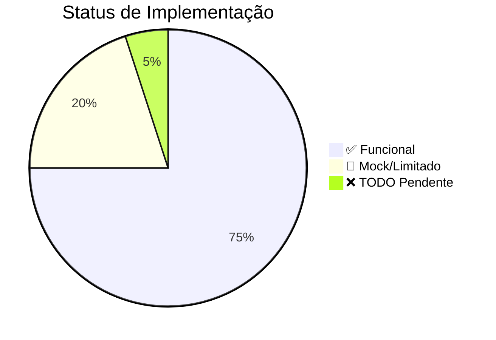

# 📚 Documentação - Shortsmaker Worker

**Sistema de processamento assíncrono para geração de vídeos curtos usando Clean Architecture e IA.**

---

## 🎯 Visão Geral do Projeto

O **Shortsmaker Worker** é um sistema distribuído e assíncrono para processamento de requisições de geração de vídeos curtos (shorts). Utiliza **Clean Architecture** com separação clara entre camadas de domínio, aplicação, adaptadores e infraestrutura.

### ✨ Características Principais

- ✅ **Clean Architecture** - Código independente de frameworks e detalhes técnicos
- ✅ **Processamento Assíncrono** - Utiliza Python AsyncIO para máxima eficiência
- ✅ **Multi-Worker** - Múltiplos workers procesando a fila em paralelo
- ✅ **Resiliência** - Sistema de retry com backoff exponencial
- ✅ **Concorrência Segura** - Usa `SELECT ... FOR UPDATE SKIP LOCKED` do PostgreSQL
- ✅ **Injeção de Dependência** - Isolamento de testes e flexibilidade
- ✅ **Migrações Automáticas** - Alembic integrado ao ciclo de vida

### 🎬 Pipeline de Processamento

```
🎬 Solicitação → 📝 Script (LLM) → 🎵 Áudio (TTS) → 🎥 Vídeo (AI) → ☁️ Storage
```

### 🏗️ Arquitetura em Camadas

```
┌─────────────────────────────────────────────────────────────┐
│                    🎯 APPLICATION LAYER                     │
│              (Use Cases - Business Logic)                   │
│  • ProcessScriptStep • ProcessAudioStep • ProcessVideoStep  │
└─────────────────────┬───────────────────────────────────────┘
                      │
                      │ depends on (Dependency Inversion)
                      ▼
┌─────────────────────────────────────────────────────────────┐
│                   🔌 INTERFACE LAYER                        │
│                   (Ports/Contracts)                         │
│  • ILLMService • IVideoService • IAudioService              │
│  • IStorageService • ITicketRepository                      │
└─────────────────────┬───────────────────────────────────────┘
                      │
                      │ implemented by
                      ▼
┌─────────────────────────────────────────────────────────────┐
│                   🔧 ADAPTER LAYER                          │
│                 (External Implementations)                  │
│  • Gemini/OpenAI • ElevenLabs • MinIO/Supabase             │
└─────────────────────┬───────────────────────────────────────┘
                      │
                      │ uses
                      ▼
┌─────────────────────────────────────────────────────────────┐
│                 🏗️ INFRASTRUCTURE LAYER                     │
│  • PostgreSQL • Alembic • Settings • Logging • Container    │
└─────────────────────────────────────────────────────────────┘
```

---

## 📖 Navegação da Documentação

### 🚀 Para Começar
| Documento | Descrição | Tempo Estimado |
|-----------|-----------|----------------|
| [**SETUP.md**](SETUP.md) | Instalação e configuração completa | 15 min |
| [**ARCHITECTURE.md**](ARCHITECTURE.md) | Arquitetura e fluxo de processamento | 20 min |
| [**STATUS.md**](STATUS.md) | Status atual e limitações | 5 min |

### 🔧 Para Desenvolvedores
| Documento | Descrição | Quando Usar |
|-----------|-----------|-------------|
| [**IMPLEMENTATION.md**](IMPLEMENTATION.md) | Detalhes técnicos e padrões | Estender o sistema |
| [**API_REFERENCE.md**](API_REFERENCE.md) | Interfaces e contratos | Implementar adapters |
| [**STATUS.md**](STATUS.md) | TODOs e próximos passos | Planejar desenvolvimento |

---

## 🎯 Casos de Uso

| Quero... | Leia isto | Tempo |
|----------|-----------|-------|
| **Rodar o worker localmente** | [SETUP.md](SETUP.md) | 15 min |
| **Entender como funciona** | [ARCHITECTURE.md](ARCHITECTURE.md) | 20 min |
| **Adicionar novo provider de IA** | [API_REFERENCE.md](API_REFERENCE.md) + [IMPLEMENTATION.md](IMPLEMENTATION.md) | 30 min |
| **Ver limitações atuais** | [STATUS.md](STATUS.md) | 5 min |
| **Contribuir com código** | [IMPLEMENTATION.md](IMPLEMENTATION.md) | 20 min |

---

## 📊 Status Atual (Jan 2026)



### ✅ Implementado e Funcional
- **Arquitetura Clean**: Separação clara Core/Adapter/Infra
- **Database as Queue**: PostgreSQL com concorrência segura
- **LLM Integration**: Gemini e OpenAI para geração de scripts
- **TTS Integration**: ElevenLabs para áudio de alta qualidade
- **Storage**: MinIO e Supabase para armazenamento de assets
- **Worker Management**: Lifecycle e graceful shutdown
- **Testes**: 16 testes passando com 63% cobertura

### ⚠️ Limitações Conhecidas
- **Vídeo Generation**: Gemini Veo retorna mock data (estrutura pronta)
- **Áudio Fallback**: Placeholder retorna bytes vazios
- **Observabilidade**: Sem métricas ou health checks
- **Limpeza de Arquivos**: MinIO não remove arquivos antigos

---

## 🛠️ Tecnologias Utilizadas

### Core
- **Python 3.11+** com AsyncIO
- **SQLAlchemy 2.0** + **Alembic** para banco
- **Pydantic v2** para validação de settings

### IA & APIs
- **Google Gemini** (LLM + Video)
- **OpenAI GPT** (LLM alternativo)
- **ElevenLabs** (Text-to-Speech)
- **Vertex AI** (para vídeo futuro)

### Infraestrutura
- **PostgreSQL** como fila de processamento
- **MinIO/S3** para armazenamento
- **Supabase** como alternativa
- **Docker** para desenvolvimento

### Desenvolvimento
- **Clean Architecture** para organização
- **Dependency Injection** com `dependency-injector`
- **pytest** + **coverage** para testes
- **black** + **isort** + **flake8** + **mypy** para qualidade

---

## 📈 Roadmap

### 🔄 Próximas Implementações (Fevereiro 2026)
- [ ] **Vídeo Real**: Integração completa com Gemini Veo 3
- [ ] **Áudio Metadata**: Extração real de metadados
- [ ] **File Cleanup**: Limpeza automática no MinIO
- [ ] **Health Checks**: Endpoint de monitoramento
- [ ] **Observabilidade**: Métricas e alertas

### 📊 Métricas Alvo
- **Cobertura de Testes**: > 80%
- **Documentação**: Zero referências quebradas
- **Performance**: < 30s por vídeo completo

---

## 🤝 Contribuição

1. Leia a [documentação de implementação](IMPLEMENTATION.md)
2. Verifique o [status atual](STATUS.md) para TODOs disponíveis
3. Siga os padrões de código e testes
4. Execute `make validate` antes de commitar

---

## 📄 Licença

Este projeto é parte do ecossistema Shortsmaker.

---

*Última atualização: Janeiro 2026*

---

## 📊 Diagramas Disponíveis

Todos os documentos contêm diagramas Mermaid interativos:

- **ARCHITECTURE_AND_FLOW.md**: 10+ diagramas de arquitetura
- **DATA_FLOW.md**: 8+ diagramas de fluxo de dados
- **COMPLETE_OVERVIEW.md**: 3+ diagramas de overview

**Total: 20+ diagramas** cobrindo toda a arquitetura.

---

## 🔍 Referência Rápida

### Arquitetura
```
Core (Domain + Application) 
  ↓ usa
Adapter (AI, Storage, Repository)
  ↓ usa
Infra (Database, Config, Logging)
```

### Fluxo de Processamento
```
PENDING → SCRIPT → AUDIO → VIDEO → COMPLETED
```

### Workers
- **ScriptWorker**: Gera roteiro (Gemini/OpenAI)
- **AudioWorker**: Gera áudio (ElevenLabs)
- **VideoWorker**: Gera vídeo (⚠️ mock)

---

## ⚠️ Limitações Conhecidas

Ver [TODO_SUMMARY.md](TODO_SUMMARY.md) para lista completa.

**Críticas:**
- Video generation retorna mock data
- Sem health check endpoint
- Sem métricas de observabilidade

---

**Última atualização**: Janeiro 2026
